# Object extraction
Martin Hinz  
`r Sys.Date()`  

This vignette will show the extraction of image data from scanned images of ceramic vessels. Assume you have a picture of a vessel like this one from @harrison_1977:


```r
library(shapAAR)
library(EBImage)
my_image <- readImage("../inst/extdata/harrison_1977_1727.png")
display(my_image, method="raster")
```


The image has, beside the vessel itself, other elements like detail drawing and a number. We would like to end up with a vector of numbers describing the shape of the profile of the vessel. To come from A to B, we need to do the following steps:

* enhance the image quality for object separation
* isolate the vessel
* correct its orientation
* extract the shape informations

## Enhancing the image

To prepare the image for separation, we use tools from the `EBImage` package. First we normalize it and increase its gamma by 5.


```r
my_image <- normalize(my_image)^5
display(my_image, method="raster")
```

<!-- -->

Much better. No we resize the image to 600 px height (using antialiasing), to increase the processing speed for later steps.


```r
my_image <- resize(my_image, h = 500, antialias = T)
display(my_image, method="raster")
```

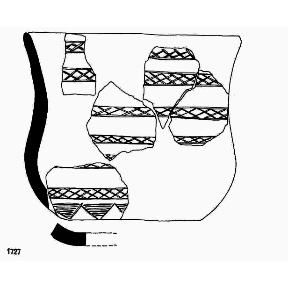<!-- -->

To let some space around the image so that later the active contour will surely wrap around the object we add some canvas.

```r
my_image <- add_canvas(my_image,10,10,center = T)
display(my_image, method="raster")
```

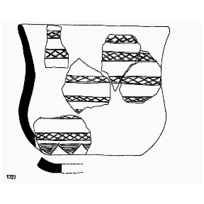<!-- -->

Now we make a binary (1,0) representation of our image. For this we first convert it to grayscale and than use a threshold calulated with Otsu's method to separate signal from background


```r
bw_image <- channel(my_image, "grey")
bw_image <- bw_image > otsu(bw_image)
display(bw_image, method="raster")
```

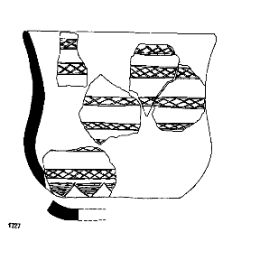<!-- -->

As last preparation step we smooth the image again using gaussian blur to get a base for the active contour algorithm:


```r
bw_image_smooth <- gblur(bw_image,1)
display(bw_image_smooth, method="raster")
```

<!-- -->

From this image we produce the stopping function of the active contour that is essentially the image gradient magnitude:


```r
bw_image_smooth <- round(1 + bw_image_smooth * 255)
bw_image_smooth <- bw_image_smooth - mean(bw_image_smooth)
g <- stopping_fun(bw_image_smooth)
display(g, method="raster")
```

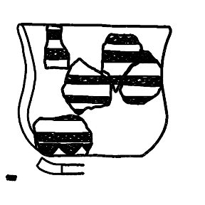<!-- -->

## Feature extraction

Now we extract the features using active contour. We do it that way because there might be different objects in the drawing, like it is the case with our example, and there might be gaps in the surrounding line of the vessel, so that we can not use a simple flood fill to differentiate between objects and background.

At first we need to set some parameters. \code{v} is the velocity of the active contour, we leave it at 1. \code{dt} is the time interval that is used for the development of the contour, we also leave it to 1. Than we set the maximum iteration length of the algorithm \code{n_iter} to 1000. At last we need a starting contour, which we define with the function \code{default_phi} as being a 5 px border around the image. We also set the buffer of the contour to 3, to avoid that the contour would penetrate dashed lines.


```r
v <- 1
dt <- 1
phi <- default_phi(g)
n_iter <- 1000
buffer <- 2
```

Now we let the active contour algorithm run and receive its result. If you do it interactively you might like to see the progress using the parameter \code{show} set to \code{TRUE}. 


```r
phi_out <- active_contour(phi, g, n_iter = n_iter, v=v, dt=dt, show = FALSE, buffer = buffer)
inner <- Image(phi_out<=0)
display(inner, method="raster")
```

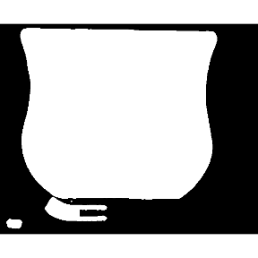<!-- -->

The resulting separation is not to bad, but it is still a bit to big, compared to the original image:


```r
segmented <- paintObjects(Image(inner),toRGB(bw_image), col='#ff00ff')
EBImage::display(segmented, method="raster", interpolate=F)
```

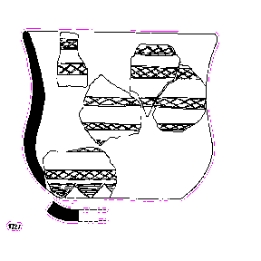<!-- -->

So we need to shrink the resulting contour by 3 pixel. This value is like the buffer we have set in the first place. So lets first fill holes, if there are any, and than shrink:


```r
inner <- fillHull(inner)
 for (i in 1:buffer) {
   inner <- EBImage::erode(inner)
 }
segmented <- paintObjects(inner,toRGB(bw_image), col='#ff00ff')
EBImage::display(segmented, method="raster", interpolate=F)
```

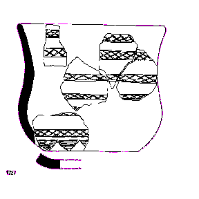<!-- -->

There we have our vessel nicely encircled. Now we have to isolate it, based on the assumption that the largest object in the image should be the object of interest. We use the \code{EBImage} function \code{bwlabel} to differentiate the individual features of the image and than select the biggest one by removing every other object:


```r
labelled_img <- EBImage::bwlabel(inner)
features <- EBImage::computeFeatures.shape(labelled_img)
all_objects <- 1:max(labelled_img)
biggest_object <- which.max(features[,1])
img_biggest_only <- rmObjects(labelled_img,all_objects[all_objects!=biggest_object])
EBImage::display(normalize(img_biggest_only), method="raster", interpolate=F)
```

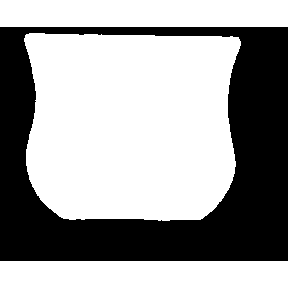<!-- -->

## Feature optimisation

Nice. Now the object is surrounded by empty space, and also the orientation is slightly tilted. First, lets crop the image:


```r
img_biggest_only <- img_crop_backgroud(img_biggest_only)
EBImage::display(img_biggest_only, method="raster", interpolate=F)
```

<!-- -->

And now rotate it using the minimal bounding rectangle:


```r
EBImage::display(img_biggest_only, method="raster", interpolate=F)

fg_points <- which(img_biggest_only!=0,arr.ind = T)
minbbox <- getMinBBox(fg_points)
moment <- 90 -minbbox$angle
if (abs(moment)>45) {moment = moment - sign(moment)*90}
img_rect <- EBImage::rotate(img_biggest_only, moment, bg.col="black")
img_rect <- img_rect > otsu(img_rect)
img_rect <-img_crop_backgroud(img_rect)

EBImage::display(img_rect, method="raster", interpolate=F)
```

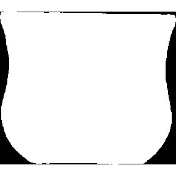

Nearly there. Now we deal with handmade ceramics, and handmade drawing and scan, resulting in the fact that the left side of the vessel is smaller than the right one. We have to cope with that and crop the vessel to its outer rims, min for both sides.


```r
EBImage::display(img_rect, method="raster", interpolate=F)
img_crop <- crop_bottom(crop_top(img_rect))

EBImage::display(img_crop, method="raster", interpolate=F)
```

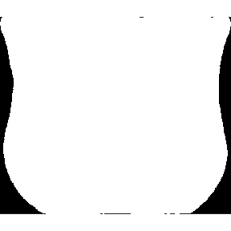

## Contour extraction

Now we can extract the contours. We do it separately for the left and the right profile. Therefor we first split the image along its center.


```r
dim_x <- nrow(img_crop)
splitaxis <- dim_x %/% 2

forward_ind <- 1:splitaxis
backward_ind <- sort((dim_x+1) - forward_ind)

left_img <- img_crop[forward_ind,]
right_img <- img_crop[backward_ind,]

EBImage::display(normalize(left_img), method="raster", interpolate=F)
EBImage::display(normalize(right_img), method="raster", interpolate=F)
```


Now we can overlay them to see how good the fit is.


```r
left_img <- flop(left_img)

segmented <- paintObjects(left_img,toRGB(right_img), col='#ff00ff')
EBImage::display(segmented, method="raster", interpolate=F)
```

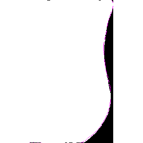<!-- -->

Not to bad in general. Let extract the contours and check whether or not they do deviate more than a given threshold:


```r
c_left <- contour_vector_bg(left_img)
c_right <- contour_vector_bg(right_img)

deviance <- sd(c_left - c_right)/length(c_left)
thresh <- 0.02
deviance < thresh
```

```
## [1] TRUE
```

The deviance is smaller than 2%, so we might be confindent, that the profiles will reflect the image properly. Now we can even take the mean of both to get rid of effects from the handmade character and/or any errors from the processing:


```r
c_mean <- round(apply(cbind(c_left, c_right),1,mean))

mean_profile <- profile_to_image(c_mean,dim(left_img)[1])
left_profile <- profile_to_image(c_left,dim(left_img)[1])
right_profile  <- profile_to_image(c_right,dim(left_img)[1])

segmented <- paintObjects(left_profile,toRGB(flop(right_img)), col='#0000ff')
segmented <- paintObjects(right_profile,segmented, col='#00ff00')
segmented <- paintObjects(mean_profile,segmented, col='#ff0000')
EBImage::display(segmented, method="raster", interpolate=F)

EBImage::display(mean_profile, method="raster", interpolate=F)
```

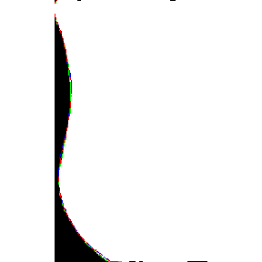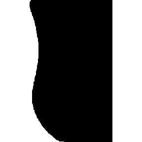

With that we have the profile of the vessel extracted, so that we can use if in further multivariate analysis.


```r
full_profile <- EBImage::tile(EBImage::combine(mean_profile, flop(mean_profile)), nx=2, lwd=0)
full_profile <- EBImage::rotate(full_profile,angle = -1 * moment)
full_profile <- resize(full_profile, w = nrow(full_profile), h = ncol(full_profile), output.dim = dim(bw_image))
full_profile <- EBImage::translate(full_profile,c(47,14))
#EBImage::display(bw_image, method="raster", interpolate=F)
segmented <- paintObjects(full_profile,toRGB(bw_image), col='#ff0000')
EBImage::display(segmented, method="raster", interpolate=F)
```

<!-- -->

## References
